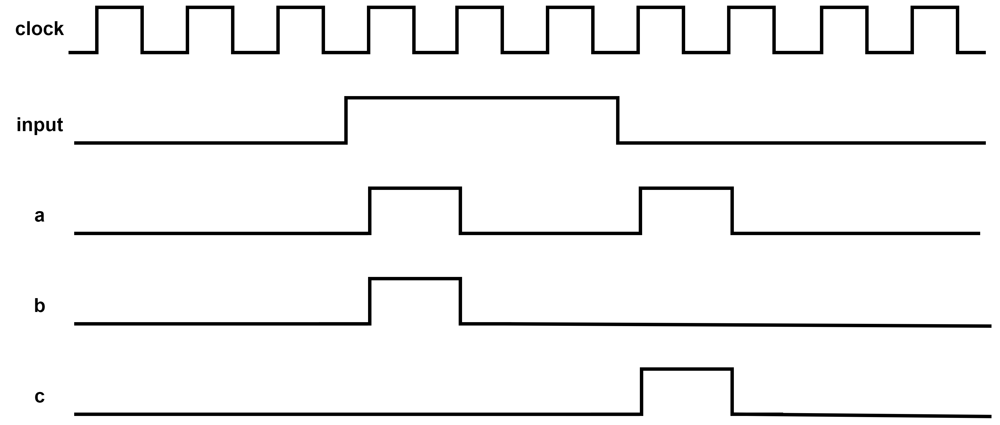
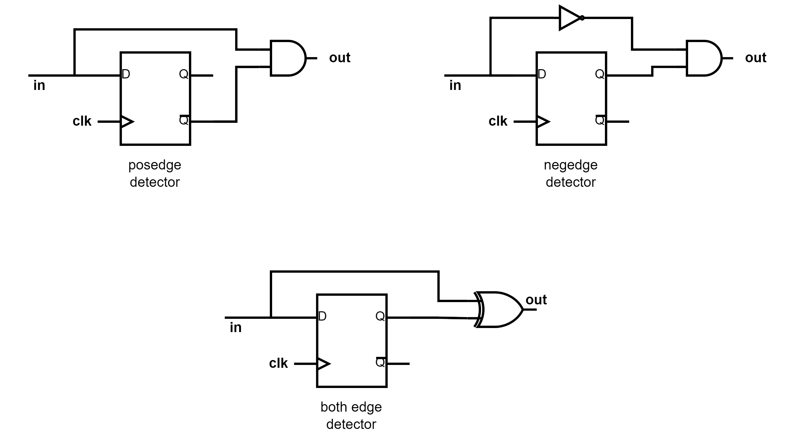

## Question
1. Design the circuit which gives the output as shown in the given waveform for the given input **input**.
   

### Solution
The circuit to detect the positive edge, negative edge and both edges is shown below.
   

